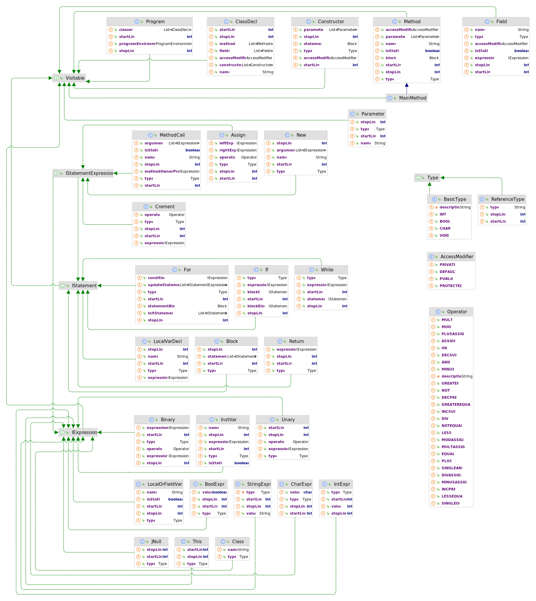

# MachMalCompiler

Herzlich willkommen bei unserem Mini-Java Compiler vom 4. Semester.

## Unterstützte Java-Syntax

```plain
//(Base-)Types:
int, booelan, char, String

//Access-Modifier:
public, private (Klassen Deklarationen ohne Access-Modifier)

//Assign-Operatoren:
ASSIGN("="), PLUSASSIGN("+="), MINUSASSIGN("-="), MULTASSIGN("*="), DIVASSIGN("/="),  MODASSIGN("%="), 

//Crement-Operatoren
INCPRE("++"), INCSUF("++"),  DECPRE("--"),  DECSUF("--"), 

//Arithmetische-Operatoren:
PLUS("+"), MINUS("-"), MULT("*"), DIV("/"), MOD("%"),

//Comparative-Operatoren:
GREATER(">"), LESS("<"), GREATEREQUAL(">="), LESSEQUAL("<="), EQUAL("=="), NOTEQUAL("!="),

//Logische-Operatoren:
NOT("!"), SINGLEAND("&"), SINGLEOR("|"), AND("&&"), OR("||");

//Statements:
if...else, while, for (auch inline-Schreibweise)

//Andere Keywörter:
class, new, this, null, static        
```
## Besonderheiten

| Funktionen                                                    | Beispiele                                                                          |
|---------------------------------------------------------------|------------------------------------------------------------------------------------|
| Assign-Operatoren                                             | += ; -= ; *= ; %=                                                                  |
| Increment und Decrement                                       | a++ ; --b                                                                          |
| Inline                                                        | if(x) a = 5;<br/> if(z) k = a-5; else a+=5;<br/>for(;;) b=7<br/> while(y) a--;     |
| For-Schleifen                                                 | for(;;) {}<br/>for(int a; a<b; a--){}                                              |
| main Methode                                                  | public static void main(String[] args){}                                           |
| Inline Initialisierung                                        | int a = 5;<br/>String alter = "elf";<br/>static String wert = new String("Hallo"); |
| Inline Initialisierung und Deklaration von mehreren Variablen | int y=3, b, c, d = 99, e = 106;                                                    |
| Bindungsstärke der Operatoren                                 | n == 0 && n == 1                                                                   |
| Verkettung von Methodenaufrufen und Instanzvariablen          | test.getInstance().a = test2.get(i).str.concat("Hallo");                           |

## Verwendete Tools
* [ANTLR4](https://www.antlr.org/) --> Wird verwendet, um den Code in einen abstrakten Syntaxbaum zu schreiben
* [ASM](https://asm.ow2.io/) --> Wird verwendet, um Bytecode aus dem typisierten Syntaxbaum zu generieren

## Projektstruktur

```plain
Compilerbau [MachMalCompiler]/
│
│
└── src
    ├── main
    │   └── java
    │       └── mmc
    │           ├── ast <-- General Java-Class Structrue to model the AST
    │           │   ├─── expressions
    │           │   ├─── main
    │           │   ├─── statementexpression
    │           │   └─── statements
    │           │
    │           ├── codegen <-- ProgramGenerator to generate the Bytecode
    │           │   └─── visitors <-- Visitor-Interfaces for the visitor-pattern
    │           │
    │           ├── compiler
    │           │
    │           ├── parser
    │           │   ├─── adapter <-- Adapter to create the Syntax-Tree (AST)
    │           │   ├─── antlr <-- generated ANTLR Code
    │           │   └─── grammar <-- MiniJava.g4-File
    │           │
    │           └── semantikcheck
    │               └─── environment
    └── test
```
## Klassendiagramm


## Komponenten

### Parser

Implementiert von Hannes Kollert und Nina Schmid.

* Der [Parser](./src/main/java/mmc/parser) übersetzt Java-Quellcode in eine abstrakte Syntax. 
* Zur Erzeugung des Parsers wird der Parser-Generator ANTLR verwendet. 
* Die Grammatik zum Parsen des Java-Quellcodes wird in einer separaten [Datei](./src/main/java/mmc/parser/MiniJava.g4) definiert. 
* Aus der Grammatik werden Klassen generiert, die den Parser repräsentieren. 
* Durch das Parsen des Quellcodes entsteht schrittweise ein Syntaxbaum. 
* Um die abstrakte Syntax zu erzeugen, werden [Adapter](./src/main/java/mmc/parser/adapter) verwendet. 
* Es werden auftretende Fehler gehandelt und über die Konsole kommuniziert.

### Semantik Check + Typisierung

Implementiert von Emma Weiß.

* Der [Semantik-Check](./src/main/java/mmc/semantikcheck) übersetzt die abstrakte Syntax in eine getypte abstrakte Syntax.
* Der Semantik-Check verwendet Regeln aus der Vorlesung, um zu prüfen, ob der Code konsistent typisiert ist.
* Der Semantik-Check leitet die Typen der Ausdrücke im Code ab.
* Es werden auftretende Fehler gehandelt und über die Konsole kommuniziert.

### Bytecode

Implementiert von Julian Schmidt.

* Der [Bytecode-Generator](./src/main/java/mmc/codegen) übersetzt die typisierte abstrakte Syntax in Bytecode.
* Hierfür wird die Java-Bibliothek ASM verwendet.
* Der Abstrakte Syntaxbaum wird durchlaufen und mittels des ASM ClassWriters Bytecode generiert.
* Das Ergebnis des Bytecode-Generators ist eine Hashmap, bei der jeder Eintrag aus dem Klassennamen und dem zugehörigen Bytecode besteht.
* Der Bytecode der Hashmaps wird in .class-Dateien geschrieben.

### Testen</h3>

Implementiert von Micha Hölle.

- Tests zur Überprüfung, ob der abstrakte Syntaxbaum korrekt generiert wird.
- Tests zur Überprüfung, ob der Semantic-Check den AST korrekt eingibt und Fehler auslöst.
- Tests zur Überprüfung, ob der Byte-Code korrekt generiert wird (Getestet mit Java-Reflections).
- Integrationstests für den gesamten Compiler zur Überprüfung verschiedener Anwendungsfälle.

## Installationsanleitung

### Ausführung in IDE
Das Projekt wurde mit [maven](https://maven.apache.org/) als Paketverwaltungsprogramm entwickelt.
Zur Ausführung aus einer IDE muss diese demnach mit maven kompatibel sein und dieses installiert sein.
Nach dem Öffnen des Projekts kann die Main-Methode mmc/Main.java ausgeführt werden, um den Compiler zu starten.

### Ausführung mit .jar-Datei
Der Compiler kann außerdem mithilfe einer Jar-Datei gestartet werden.
Die aktuellste Jar-Datei [Jar-Datei](./MachMalCompiler.jar) kann mit dem Befehl ```java -jar MachMalCompiler.jar``` ausgeführt werden.

### Generelles
1. Nach dem Starten des Compilers muss zunächst die zu kompilierende ```.java```-Datei als Dateipfad übergeben werden.
2. Anschließend kann ggf. ein gewünschter Pfad zur Ablage der generierten ```.class```-Dateien angeben werden
3. Wird kein eigener Ablagepfad angegeben, wird im Ordner des Jar-Files ein ```gen```-Ordner erstellt, welcher die Output-Dateien erhält.
